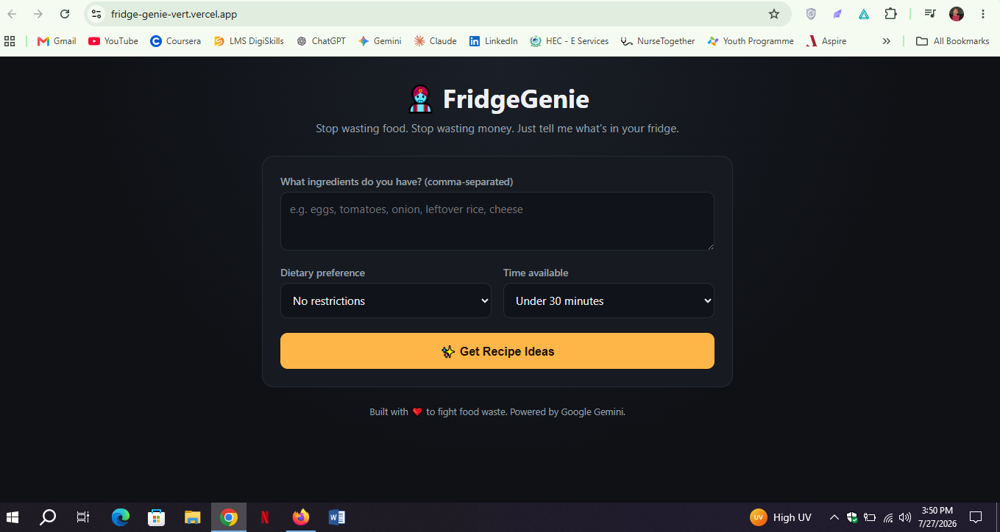

# 🧞 FridgeGenie

**FridgeGenie turns the random ingredients in your fridge into real, cookable recipes — so you stop throwing away food and stop ordering takeout you can't afford.**

### The problem, and who it's for
Students and anyone living on a tight budget end up with half-used bags of vegetables, leftover rice, or random pantry items — and no idea what to actually cook with them. The result is either food waste (things rot before you use them) or wasted money (you order food instead). FridgeGenie solves this by letting you type in exactly what you have, and instantly getting real recipes built around *those* ingredients, tailored to your diet and how much time you have.

---

## 🔗 Live App
**[TODO: fridge-genie-vert.vercel.app]**

## 📦 GitHub Repository
**[TODO: https://github.com/azlansh959/FridgeGenie]**

---

## ✨ Features
- Enter any list of ingredients you currently have (comma-separated, free text)
- Choose a dietary preference: no restrictions, vegetarian, vegan, halal, or high-protein
- Choose how much time you have: under 15 min, under 30 min, under 1 hour, or no rush
- AI instantly generates **3 recipes**, ordered from easiest to most involved, each with:
  - Title, time estimate, and difficulty
  - The exact ingredients used (from what you listed)
  - Step-by-step instructions
  - A short practical cooking tip
- Clean, responsive, mobile-friendly single-page interface
- Clear error handling if the AI or network fails (no silent breakage)

## 🤖 The AI Feature
The core of FridgeGenie is a single AI-powered endpoint (`/api/recipe`) that takes the user's ingredients, dietary preference, and time limit, and returns structured recipe data. It's powered by **Google Gemini** (`gemini-3.5-flash-lite`), called from a Vercel serverless function so the API key never touches the browser.

**System prompt used (verbatim, from `api/recipe.js`):**

```
You are FridgeGenie, a practical home-cooking assistant whose job is to
stop food waste by helping people cook with what they already have.

Rules you MUST follow:
1. Only suggest recipes that can be made PRIMARILY from the ingredients the user listed.
   You may assume the user has basic pantry staples (salt, pepper, oil, water, sugar) even
   if they didn't mention them, but do NOT assume they have any other ingredient.
2. Respect the user's dietary preference and time constraint exactly as given.
3. Suggest exactly 3 different recipes, ordered from easiest/fastest to most involved.
4. Be realistic and specific — real dishes, real steps, no vague filler like "cook until done".
5. If the ingredients genuinely don't make sense together, still do your best to suggest
   something edible rather than refusing.
6. Respond ONLY with valid JSON matching this exact schema, no markdown, no commentary:

{
  "recipes": [
    {
      "title": "string",
      "time_estimate": "string, e.g. '20 minutes'",
      "difficulty": "Easy | Medium | Hard",
      "ingredients_used": ["string", "..."],
      "steps": ["string", "..."],
      "tip": "string, one short practical tip"
    }
  ]
}
```

The app forces structured JSON output (via Gemini's `responseMimeType: "application/json"`), parses it server-side, and renders it as clean recipe cards on the frontend — rather than dumping raw AI text at the user.

## 🛠 Tools, Services, and Models Used
- **Frontend:** Plain HTML, CSS, and vanilla JavaScript (no framework, no build step)
- **Backend:** A single Vercel serverless function (`api/recipe.js`, Node.js runtime)
- **AI model:** Google Gemini (`gemini-3.5-flash-lite`) via the Gemini API
- **Hosting/Deployment:** Vercel (free tier)
- **Version control:** Git + GitHub (public repo)
- **AI assistance during build:** Claude (Anthropic) was used to help scaffold and debug the code

## 📸 Screenshots



---

## 🚀 How to Run This Project

### Option A — Just use the live app
Open the [live URL](#-live-app) above. No setup needed.

### Option B — Run it locally
**Requirements:** Node.js 18+, a free [Gemini API key](https://aistudio.google.com/apikey), and the [Vercel CLI](https://vercel.com/cli).

```bash
# 1. Clone the repo
git clone <your-repo-url>
cd fridgegenie

# 2. Install the Vercel CLI (if you don't have it)
npm install -g vercel

# 3. Add your API key
cp .env.example .env
# then open .env and paste your real Gemini API key

# 4. Run locally (serves both frontend and the /api function)
vercel dev
```

Then open `http://localhost:3000` in your browser.

### Deploying your own copy to Vercel
1. Push this repo to your own public GitHub account.
2. Go to [vercel.com](https://vercel.com), click **Add New Project**, and import the GitHub repo.
3. In the project's **Settings → Environment Variables**, add:
   - `GEMINI_API_KEY` = your Gemini API key
4. Click **Deploy**. Vercel automatically detects the static frontend and the `/api` serverless function — no build configuration needed.
5. Once deployed, your live URL will look like `https://your-project-name.vercel.app`.

---

## 🔒 Notes on Security
- The Gemini API key is stored only as a Vercel environment variable and is never exposed to the browser or committed to the repo (`.env` is in `.gitignore`).
- All AI calls happen server-side inside `api/recipe.js`.
